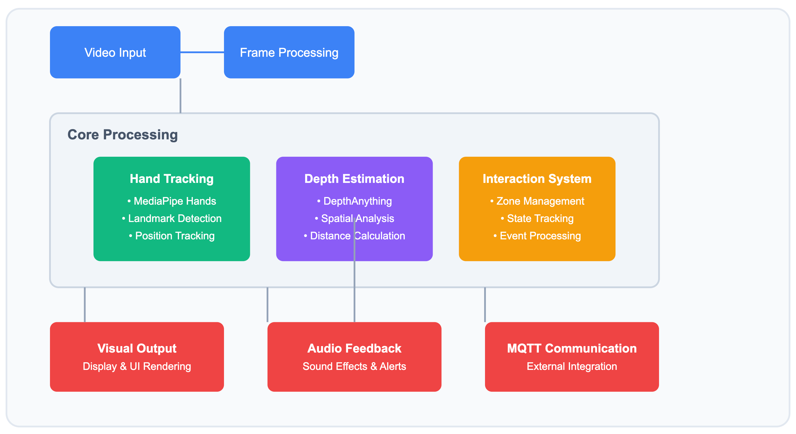
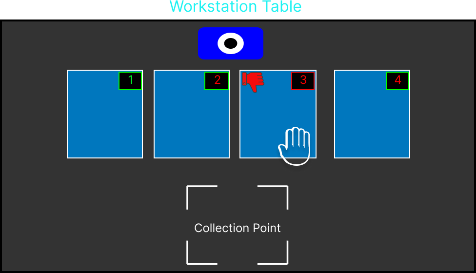

# HandTrack3D: Interactive Hand Tracking System

A sophisticated real-time hand tracking system that combines depth estimation, gesture recognition, and interactive zone detection for creating engaging human-computer interaction experiences.

## 🌟 Features

- **Real-time Hand Tracking**: Utilizes MediaPipe for accurate hand landmark detection
- **Depth Estimation**: Implements DepthAnything model for precise depth perception
- **Interactive Zones**: Create custom interaction areas with visual feedback
- **MQTT Integration**: Real-time communication for distributed systems
- **Visual Feedback**: Dynamic UI with progress tracking and status indicators
- **Sound Effects**: Audio feedback for enhanced user experience
- **Performance Monitoring**: Real-time FPS counter and system statistics

## 🏗️ System Architecture

The system is built with a modular architecture that ensures high performance and maintainability:





## Repository Structure


```
HandTrack3D/
├── src/
│   ├── __init__.py
│   ├── main.py
│   ├── config.py
│   ├── hand_tracker.py
│   ├── depth_estimator.py
│   ├── interaction_system.py
│   └── utils/
│       ├── __init__.py
│       ├── visualization.py
│       └── mqtt_handler.py
├── assets/
│   ├── sounds/
│   │   ├── ring_1.mp3
│   │   └── ring_2.mp3
│   └── images/
│       ├── thumbs_up.png
│       └── thumbs_down.png
├── tests/
│   └── __init__.py
├── docs/
│   └── API.md
├── requirements.txt
├── LICENSE
└── README.md
```

<svg viewBox="0 0 800 400" xmlns="http://www.w3.org/2000/svg">
  <!-- Background -->
  <rect width="800" height="400" fill="#f8fafc"/>
  
  <!-- Root Container -->
  <g transform="translate(20, 20)">
    <!-- HandTrack3D Root -->
    <rect x="0" y="0" width="760" height="40" rx="5" fill="#3b82f6"/>
    <text x="20" y="25" font-family="Arial" font-size="16" fill="white">HandTrack3D/</text>
    <!-- Main Directories -->
    <g transform="translate(20, 50)">
      <!-- src directory -->
      <rect x="0" y="0" width="350" height="200" rx="5" fill="#10b981" fill-opacity="0.1" stroke="#10b981"/>
      <text x="10" y="20" font-family="Arial" font-size="14" fill="#10b981">src/</text>
      <text x="10" y="45" font-family="Arial" font-size="12" fill="#475569">• main.py</text>
      <text x="10" y="65" font-family="Arial" font-size="12" fill="#475569">• config.py</text>
      <text x="10" y="85" font-family="Arial" font-size="12" fill="#475569">• hand_tracker.py</text>
      <text x="10" y="105" font-family="Arial" font-size="12" fill="#475569">• depth_estimator.py</text>
      <text x="10" y="125" font-family="Arial" font-size="12" fill="#475569">• interaction_system.py</text>
      <!-- utils subdirectory -->
      <rect x="20" y="140" width="310" height="50" rx="5" fill="#0d9488" fill-opacity="0.1" stroke="#0d9488"/>
      <text x="30" y="160" font-family="Arial" font-size="12" fill="#0d9488">utils/</text>
      <text x="30" y="180" font-family="Arial" font-size="12" fill="#475569">• visualization.py, mqtt_handler.py</text>
      <!-- assets directory -->
      <rect x="370" y="0" width="350" height="120" rx="5" fill="#8b5cf6" fill-opacity="0.1" stroke="#8b5cf6"/>
      <text x="380" y="20" font-family="Arial" font-size="14" fill="#8b5cf6">assets/</text>
      <text x="380" y="45" font-family="Arial" font-size="12" fill="#475569">sounds/</text>
      <text x="390" y="65" font-family="Arial" font-size="12" fill="#475569">• ring_1.mp3, ring_2.mp3</text>
      <text x="380" y="85" font-family="Arial" font-size="12" fill="#475569">images/</text>
      <text x="390" y="105" font-family="Arial" font-size="12" fill="#475569">• thumbs_up.png, thumbs_down.png</text>
      <!-- Other directories -->
      <rect x="370" y="140" width="165" height="50" rx="5" fill="#ef4444" fill-opacity="0.1" stroke="#ef4444"/>
      <text x="380" y="160" font-family="Arial" font-size="14" fill="#ef4444">tests/</text>
      <text x="380" y="180" font-family="Arial" font-size="12" fill="#475569">• __init__.py</text>
      <rect x="555" y="140" width="165" height="50" rx="5" fill="#f59e0b" fill-opacity="0.1" stroke="#f59e0b"/>
      <text x="565" y="160" font-family="Arial" font-size="14" fill="#f59e0b">docs/</text>
      <text x="565" y="180" font-family="Arial" font-size="12" fill="#475569">• API.md</text>
    </g>
    <!-- Root Files -->
    <rect x="20" y="270" width="720" height="60" rx="5" fill="#64748b" fill-opacity="0.1" stroke="#64748b"/>
    <text x="30" y="290" font-family="Arial" font-size="14" fill="#64748b">Root Files</text>
    <text x="30" y="315" font-family="Arial" font-size="12" fill="#475569">• requirements.txt    • LICENSE    • README.md</text>
  </g>
</svg>

## 🚀 Quick Start

1. **Clone the repository**
```bash
git clone https://github.com/armanruet/HandTrack3D.git
cd HandTrack3D
```

2. **Install dependencies**
```bash
pip install -r requirements.txt
```

3. **Run the application**
```bash
python main.py
```

## 📦 Dependencies

- Python 3.8+
- OpenCV
- MediaPipe
- PyTorch
- Paho-MQTT
- Pygame
- NumPy
- PIL

## 🎮 Usage

1. **Launch the application**
   - The system will automatically access your camera
   - A fullscreen window will open showing the camera feed

2. **Create interaction zones**
   - Click and drag to draw up to 3 interaction zones
   - Each zone will be automatically labeled (A, B, C)

3. **Interact with zones**
   - Move your hand within the zones
   - Watch for visual and audio feedback
   - Monitor progress through the status bar

4. **Controls**
   - Press 'q' to quit
   - Press 'f' to toggle fullscreen

## 🛠️ Configuration

Key parameters can be adjusted in `config.py`:

```python
# UI Parameters
BOX_LINE_THICKNESS = 3
TARGET_BOX_COLOR = (0, 255, 0)
NON_TARGET_BOX_COLOR = (255, 0, 0)
TEXT_COLOR = (255, 255, 255)

# Depth Thresholds
DEPTH_THRESHOLD_NEAR = 0.20
DEPTH_THRESHOLD_FAR = 0.63
```

## 🔧 Advanced Features

### Depth Estimation
The system uses the DepthAnything model for accurate depth perception:
```python
depth_anything = DepthAnything.from_pretrained(f"LiheYoung/depth_anything_{encoder}14")
```

### MQTT Communication
Integrated MQTT broker for distributed system communication:
```python
client.connect("your-broker-address", 1883, 60)
```

## 📊 Performance

The system includes built-in performance monitoring:
- Real-time FPS counter
- Hand detection status
- Interaction timer
- Progress tracking

## 🤝 Contributing

Contributions are welcome! Please feel free to submit a Pull Request. For major changes, please open an issue first to discuss what you would like to change.

## 📄 License

This project is licensed under the MIT License - see the [LICENSE](LICENSE) file for details.

## 🙏 Acknowledgments

- MediaPipe team for their excellent hand tracking solution
- DepthAnything team for their depth estimation model
- All contributors and supporters of this project

## 📞 Contact

For questions and support, please open an issue or contact the maintainers:
- Email: armanruet@gmail.com
- LinkedIn: [armanruet](https://www.linkedin.com/in/armanruet/)

---
Made with ❤️ by Arman
